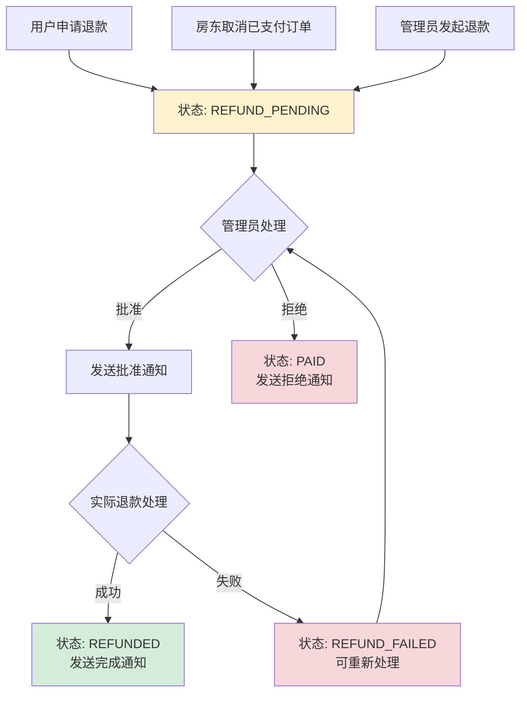

# 完整退款流程设计与实现

## 🔄 **退款处理完整流程**

### 📋 **流程概览**



## 🛠️ **技术实现**

### 1. **后端接口完善**

#### **新增服务方法**

```java
public interface OrderService {
    // 管理员批准退款申请
    OrderDTO approveRefund(Long id, String refundNote);

    // 管理员拒绝退款申请
    OrderDTO rejectRefund(Long id, String rejectReason);

    // 管理员完成退款处理
    OrderDTO completeRefund(Long id, String refundTransactionId);
}
```

#### **控制器端点**

- `POST /api/admin/orders/{id}/refund/approve` - 批准退款
- `POST /api/admin/orders/{id}/refund/reject` - 拒绝退款
- `POST /api/admin/orders/{id}/refund/complete` - 完成退款

### 2. **状态流转规则**

| 当前状态       | 操作     | 目标状态       | 操作者    |
| -------------- | -------- | -------------- | --------- |
| PAID           | 申请退款 | REFUND_PENDING | 用户/房东 |
| REFUND_PENDING | 批准退款 | REFUND_PENDING | 管理员    |
| REFUND_PENDING | 拒绝退款 | PAID           | 管理员    |
| REFUND_PENDING | 完成退款 | REFUNDED       | 管理员    |
| REFUND_FAILED  | 重新处理 | REFUND_PENDING | 管理员    |

### 3. **通知系统完善**

#### **新增通知类型**

```java
public enum NotificationType {
    REFUND_REQUESTED,     // 退款申请已提交
    REFUND_APPROVED,      // 退款申请已批准
    REFUND_REJECTED,      // 退款申请被拒绝
    REFUND_COMPLETED      // 退款已完成
}
```

#### **通知内容示例**

- **申请提交**："您的退款申请已提交，我们将在 1-3 个工作日内处理"
- **批准通知**："您的退款申请已批准，我们正在处理退款"
- **拒绝通知**："很抱歉，您的退款申请被拒绝。原因：xxx"
- **完成通知**："好消息！您的退款已完成，请注意查收"

## 👥 **操作角色与权限**

### **用户角色**

- ✅ 申请退款（已支付订单）
- ❌ 无法直接处理退款状态
- ✅ 接收退款进度通知

### **房东角色**

- ✅ 取消已支付订单（自动进入退款流程）
- ❌ 无法直接处理退款状态
- ✅ 接收相关通知

### **管理员角色**

- ✅ 发起退款（对已支付订单）
- ✅ 批准/拒绝退款申请
- ✅ 完成退款处理
- ✅ 查看所有退款记录

## 🖥️ **前端界面设计**

### **管理员操作界面**

#### **订单列表按钮逻辑**

```typescript
// 根据支付状态显示不同按钮
if (paymentStatus === "PAID") {
  // 显示"发起退款"按钮
}

if (paymentStatus === "REFUND_PENDING") {
  // 显示"批准退款"、"拒绝退款"、"完成退款"按钮
}
```

#### **操作确认对话框**

- **批准退款**：输入框收集批准备注
- **拒绝退款**：必填输入框收集拒绝原因
- **完成退款**：可选输入框收集退款交易号

### **用户界面显示**

#### **状态显示优化**

```typescript
const getStatusText = (order) => {
  // 优先显示退款状态
  if (status === "REFUND_PENDING") return "退款中";
  if (status === "REFUNDED") return "已退款";
  if (status === "REFUND_FAILED") return "退款失败";
  // ... 其他状态
};
```

## 📊 **业务规则与策略**

### **退款处理时机**

1. **自动进入退款**：已支付订单被取消时
2. **手动发起退款**：管理员主动处理异常订单
3. **用户申请退款**：用户主动申请（调用取消接口）

### **退款审核规则**

- 所有退款申请需要管理员审核
- 拒绝退款需要提供详细原因
- 批准退款后需要手动完成退款处理

### **状态恢复机制**

- 拒绝退款：订单恢复为已支付状态
- 退款失败：可重新进入退款流程
- 完成退款：订单进入最终状态

## 🔧 **实际对接要点**

### **支付网关集成**

```java
// 在 approveRefund 方法中应该调用
PaymentGatewayResult result = paymentGatewayService.processRefund(
    order.getPaymentId(),
    order.getTotalAmount(),
    refundReason
);

if (result.isSuccess()) {
    // 直接完成退款
    order.setPaymentStatus(PaymentStatus.REFUNDED);
} else {
    // 标记为退款失败
    order.setPaymentStatus(PaymentStatus.REFUND_FAILED);
}
```

### **异步处理建议**

```java
// 退款可能需要时间，建议异步处理
@Async
public void processRefundAsync(Long orderId) {
    // 调用支付网关
    // 更新订单状态
    // 发送通知
}
```

## 📈 **优势与改进**

### **✅ 现在的优势**

1. **完整的状态流转**：覆盖退款的各个阶段
2. **权限控制清晰**：不同角色有不同的操作权限
3. **通知机制完善**：用户能及时了解退款进度
4. **操作审计完整**：所有退款操作都有记录和备注
5. **前端体验友好**：状态显示准确，操作流程顺畅

### **⚠️ 待完善项**

1. **支付网关集成**：需要对接真实的退款 API
2. **退款金额计算**：支持部分退款和违约金扣除
3. **退款记录表**：独立的退款记录管理
4. **自动化流程**：某些情况下的自动退款

## 🎯 **总结**

通过完善退款处理流程，现在系统具备了：

### **完整的退款处理链条**

- 申请 → 审核 → 处理 → 完成
- 每个环节都有明确的操作者和通知机制

### **灵活的处理方式**

- 支持批准/拒绝退款申请
- 支持重新处理失败的退款
- 支持详细的操作备注

### **良好的用户体验**

- 状态显示准确直观
- 通知及时详细
- 操作流程顺畅

这样就彻底解决了之前"退款中状态没有后续处理"的问题，形成了完整的退款业务闭环！
