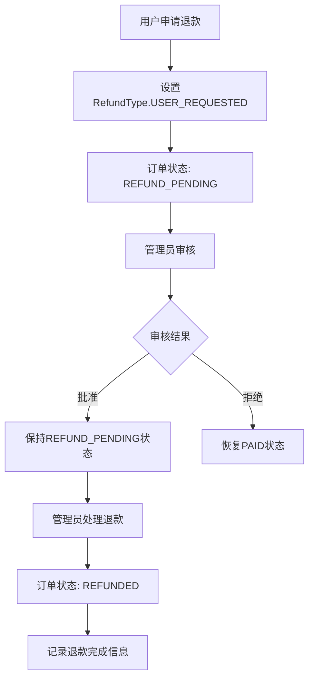

# 退款系统完善总结

## 📋 **完成的核心改进**

### 1. **后端数据模型增强**

#### 新增字段到 Order 实体

- `refundType` - 退款类型枚举
- `refundReason` - 退款原因
- `refundAmount` - 退款金额
- `refundInitiatedBy` - 退款发起者 ID
- `refundInitiatedAt` - 退款发起时间
- `refundProcessedBy` - 退款处理者 ID
- `refundProcessedAt` - 退款处理时间
- `refundTransactionId` - 退款交易号

#### 新增 RefundType 枚举

```java
public enum RefundType {
    USER_REQUESTED("用户申请"),
    HOST_CANCELLED("房东取消"),
    ADMIN_INITIATED("管理员发起"),
    SYSTEM_AUTOMATIC("系统自动");
}
```

### 2. **数据库迁移脚本**

- 创建了 `V10__add_refund_fields_to_orders.sql`
- 添加了退款相关字段和索引

### 3. **后端 API 接口完善**

#### OrderController 新增接口

- `POST /api/orders/{id}/refund` - 用户申请退款
- `GET /api/orders/{id}/refund-details` - 获取退款详情

#### AdminOrderController 已有接口

- `POST /api/admin/orders/{id}/refund/approve` - 批准退款
- `POST /api/admin/orders/{id}/refund/reject` - 拒绝退款
- `POST /api/admin/orders/{id}/refund/complete` - 完成退款

#### OrderService 新增方法

- `requestUserRefund(Long id, String reason)` - 用户申请退款
- 完善了退款信息记录逻辑

### 4. **前端功能完善**

#### MyOrders.vue (用户端)

- **状态显示优化**：显示退款类型信息
  - `已退款（用户申请）`
  - `退款中（房东取消）`
  - `已退款（管理员发起）`等
- **新增组件**：OrderDetailModal 订单详情弹窗
- **新增功能**：申请退款按钮和处理逻辑
- **数据映射**：包含完整的退款相关字段

#### OrderManage.vue (房东端)

- **状态显示同步**：与用户端保持一致的退款类型显示
- **筛选选项**：添加退款相关状态的筛选
- **接口定义**：HostOrderItem 增加退款字段

#### 新增组件

- `OrderDetailModal.vue` - 完整的订单详情弹窗
  - 显示基本订单信息
  - 显示详细退款流程信息
  - 显示操作历史和处理记录

#### 新增 API 文件

- `refund.ts` - 退款相关 API 接口封装

### 5. **类型定义完善**

- 更新了 `PaymentStatus` 类型，增加退款状态
- 完善了 `OrderItem` 和 `HostOrderItem` 接口定义

## 🔄 **完整的退款流程**

### 用户视角

1. **发起退款**：在"我的订单"中点击"申请退款"
2. **填写原因**：可选择性填写退款原因
3. **状态跟踪**：
   - 显示"退款中（用户申请）"
   - 可查看详细退款信息
   - 显示发起时间、原因等

### 房东视角

1. **状态同步**：房东端同步显示退款状态
2. **信息透明**：可查看退款类型和发起者
3. **状态区分**：
   - "退款中（用户申请）" - 用户主动申请
   - "退款中（房东取消）" - 房东取消订单导致

### 管理员视角

1. **审核退款**：批准或拒绝退款申请
2. **处理退款**：通过支付网关处理实际退款
3. **完成流程**：标记退款完成并记录交易号

## 🎯 **解决的关键问题**

### ✅ **问题 1：退款类型区分不清**

**解决方案**：

- 新增 RefundType 枚举，明确区分退款发起方
- 前端显示具体的退款类型："已退款（用户申请）"等
- 后端记录完整的退款发起信息

### ✅ **问题 2：退款发起者信息缺失**

**解决方案**：

- 记录 `refundInitiatedBy` 和 `refundInitiatedByName`
- 记录 `refundProcessedBy` 和 `refundProcessedByName`
- 在订单详情中显示完整的处理链路

### ✅ **问题 3：订单详情页信息不完整**

**解决方案**：

- 新增 OrderDetailModal 组件
- 显示完整的退款流程信息：
  - 退款类型、原因、金额
  - 发起人、发起时间
  - 处理人、处理时间
  - 退款交易号
- 集成到用户和房东的订单管理页面

## 📊 **数据流向图**



## 🚀 **技术亮点**

1. **数据完整性**：退款信息从发起到完成的完整记录
2. **类型安全**：TypeScript 类型定义完善，减少运行时错误
3. **用户体验**：直观的状态显示和详细的信息展示
4. **权限控制**：不同角色看到对应的操作界面
5. **扩展性**：支持多种退款类型，便于未来扩展

## 📈 **效果对比**

| 方面       | 改进前           | 改进后                       |
| ---------- | ---------------- | ---------------------------- |
| 状态显示   | 统一显示"退款中" | 详细显示"退款中（用户申请）" |
| 发起者信息 | 无法知道谁发起   | 明确显示发起人和类型         |
| 订单详情   | 缺少退款进度     | 完整的退款流程信息           |
| 用户体验   | 信息不透明       | 流程清晰、信息完整           |
| 数据追踪   | 退款信息缺失     | 完整的操作历史记录           |

## 🔮 **未来改进建议**

1. **支付网关集成**：与真实支付平台的退款 API 对接
2. **部分退款**：支持非全额退款场景
3. **退款进度通知**：邮件/短信通知退款状态变更
4. **退款统计报表**：管理员查看退款数据分析
5. **自动退款规则**：特定条件下的自动退款处理

---

通过这次完善，退款系统从简单的状态显示升级为具有完整业务流程、清晰信息展示和良好用户体验的综合性功能模块。
