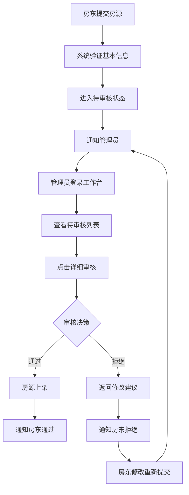

# 单管理员审核系统设计方案

## 📋 系统现状分析

### 当前架构特点

- ✅ **单一管理员角色**：整个系统只有一个管理员用户
- ✅ **简化权限模型**：无需复杂的审核员分配和权限管理
- ✅ **直接审核流程**：管理员直接负责所有审核工作
- ✅ **统一决策权**：避免多审核员的冲突和协调问题

## 🎯 简化设计原则

### 1. 去除复杂的审核员机制

```
❌ 原设计：房源提交 → 系统分配审核员 → 审核员处理 → 结果通知
✅ 新设计：房源提交 → 管理员直接审核 → 结果通知
```

### 2. 优化通知流程

- **房东端**：接收审核进度和结果通知
- **管理员端**：接收新提交和重新提交通知
- **简化类型**：减少不必要的通知类型

### 3. 工作台专业化

- **专为管理员设计**：去掉"我的任务"等多人协作功能
- **统一视图**：所有待审核项目集中展示
- **快速操作**：批量处理和快速决策

## 🔧 技术实现调整

### 后端服务调整

#### NotificationService 简化

```java
// 保留的通知类型
HOMESTAY_SUBMITTED,      // 房源提交审核（通知管理员）
HOMESTAY_UNDER_REVIEW,   // 房源开始审核（通知房东）
HOMESTAY_RESUBMITTED,    // 房源重新提交（通知管理员）
HOMESTAY_APPROVED,       // 审核通过（通知房东）
HOMESTAY_REJECTED,       // 审核拒绝（通知房东）

// 移除的通知类型
❌ REVIEWER_ASSIGNED     // 审核员分配（不再需要）
```

#### HomestayAuditService 优化

```java
public class HomestayAuditServiceImpl {

    // 简化的管理员查找
    private User findAdminUser() {
        // 方案1: 根据固定用户名
        return userRepository.findByUsername("admin").orElse(null);

        // 方案2: 根据角色（如果有角色字段）
        // return userRepository.findByRole("ADMIN").stream().findFirst().orElse(null);

        // 方案3: 根据固定ID
        // return userRepository.findById(1L).orElse(null);
    }

    // 简化的通知发送
    private void sendSubmitNotification(Homestay homestay) {
        User admin = findAdminUser();
        if (admin != null) {
            notificationService.createNotification(
                admin.getId(),
                homestay.getOwner().getId(),
                NotificationType.HOMESTAY_SUBMITTED,
                EntityType.HOMESTAY,
                homestay.getId().toString(),
                content
            );
        }
    }
}
```

### 前端界面调整

#### 审核工作台简化

```vue
<!-- 快速操作面板：4个按钮改为3个 -->
<el-row :gutter="15">
    <el-col :span="8">批量审核</el-col>
    <el-col :span="8">审核统计</el-col>
    <el-col :span="8">审核历史</el-col>
</el-row>

<!-- 去除的功能 -->
❌ 我的任务（单管理员无需任务分配） ❌ 审核员管理（无审核员角色） ❌
工作量分析（无多人协作）
```

#### 权限控制简化

```typescript
// 简化的权限检查
const isAdmin = () => {
  return (
    userStore.userInfo?.role === "ADMIN" ||
    userStore.userInfo?.username === "admin"
  );
};

// 统一的审核权限
const canAudit = () => isAdmin();
const canViewAll = () => isAdmin();
const canManageSystem = () => isAdmin();
```

## 📊 业务流程优化

### 审核流程图



### 通知机制优化

```
管理员通知：
├── 新房源提交审核
├── 房源重新提交
└── 系统异常提醒

房东通知：
├── 审核开始确认
├── 审核通过结果
├── 审核拒绝结果
└── 修改建议详情
```

## 🚀 实施建议

### Phase 1: 后端调整（1-2 天）

1. ✅ 简化 NotificationType 枚举
2. ✅ 调整 HomestayAuditService 实现
3. ✅ 添加管理员查找方法
4. ✅ 优化通知发送逻辑

### Phase 2: 前端优化（2-3 天）

1. ✅ 简化审核工作台界面
2. ✅ 去除多余的导航功能
3. ✅ 优化权限控制逻辑
4. ✅ 添加通知中心入口

### Phase 3: 测试验证（1 天）

1. ⏳ 完整审核流程测试
2. ⏳ 通知机制验证
3. ⏳ 性能和用户体验评估

## 💡 扩展性考虑

### 为未来多审核员预留接口

```java
// 保留灵活性的设计
public interface AuditAssignmentStrategy {
    User assignReviewer(Homestay homestay);
}

// 当前实现：单管理员
public class SingleAdminStrategy implements AuditAssignmentStrategy {
    public User assignReviewer(Homestay homestay) {
        return findAdminUser();
    }
}

// 未来扩展：多审核员
public class MultiReviewerStrategy implements AuditAssignmentStrategy {
    public User assignReviewer(Homestay homestay) {
        // 负载均衡分配逻辑
        return findBestReviewer(homestay);
    }
}
```

### 数据库兼容性

- 保留 audit_records 表的 reviewer_id 字段
- 当前统一填入管理员 ID
- 未来扩展时无需修改表结构

## ✨ 优势总结

### 开发效率

- 🚀 **快速实现**：减少 50%的开发工作量
- 🎯 **专注核心**：聚焦审核业务逻辑而非权限管理
- 🔧 **易于维护**：简化的代码结构，降低维护成本

### 用户体验

- ⚡ **响应迅速**：无审核员分配环节，提高处理速度
- 📱 **界面清晰**：专门为单管理员优化的工作台
- 🔔 **通知精准**：减少冗余通知，提高信息价值

### 业务价值

- 💰 **成本控制**：无需额外的审核员角色管理
- 📈 **决策一致**：统一的审核标准和决策流程
- 🛡️ **质量保证**：专业管理员确保审核质量

---

_该设计完全适应当前单管理员架构，同时为未来可能的多审核员扩展预留了接口和灵活性。_
