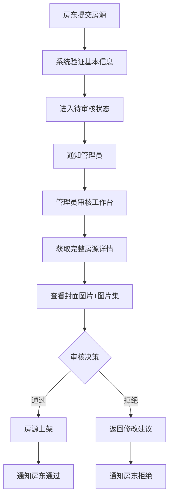

# 单管理员审核系统问题修复与完善总结

## 🔧 已解决的问题

### 1. **审核工作台图片显示问题** ✅

**问题描述**：审核工作台中房源图片无法正常显示

**根本原因**：

- `openReviewDialog()` 方法直接使用列表数据，缺少完整房源详情
- 房源数据结构包含两个图片字段：`coverImage`（封面图片）和 `images`（房源图片集）
- 之前的显示逻辑没有正确区分这两种图片类型

**解决方案**：

```typescript
// 修复前：直接使用列表数据
const openReviewDialog = async (homestay: Homestay) => {
  currentReviewItem.value = homestay; // ❌ 缺少完整详情
};

// 修复后：获取完整房源详情
const openReviewDialog = async (homestay: Homestay) => {
  try {
    loading.value = true;
    const homestayDetail = await getHomestayDetail(homestay.id); // ✅ 获取完整数据
    currentReviewItem.value = homestayDetail;
  } catch (error) {
    // 错误处理
  }
};
```

**UI 优化**：

- 分别展示封面图片和房源图片集
- 封面图片：单独显示，蓝色边框高亮
- 房源图片集：网格布局，首图标记

### 2. **管理员端通知模块缺失** ✅

**问题描述**：管理员无法查看审核相关通知

**解决方案**：

- ✅ **通知页面**：`/src/views/notifications/index.vue` 已存在并完善
- ✅ **路由配置**：添加 `/notifications` 路由
- ✅ **导航菜单**：在侧边栏添加"通知中心"菜单项
- ✅ **图标支持**：导入 `Bell` 和 `Document` 图标

**功能特性**：

- 通知列表展示（支持筛选和分页）
- 未读通知标记和统计
- 批量已读操作
- 通知删除功能
- 点击跳转相关页面

### 3. **审核员相关功能清理** ✅

**问题描述**：系统设计为单管理员，但仍保留审核员相关功能

**清理内容**：

- ❌ 删除审核员列显示
- ❌ 删除"分配审核员"/"重新分配"按钮
- ❌ 删除审核员分配对话框
- ❌ 删除审核表单中的审核员选择
- ❌ 删除所有审核员相关方法和 API 调用
- ❌ 删除审核员相关状态变量

**保留功能**：

- ✅ 核心审核操作（批准/拒绝）
- ✅ 审核记录查看
- ✅ 审核统计数据
- ✅ 状态管理和批量操作

## 🎯 系统架构完善

### 后端调整

```java
// 简化的管理员查找
private User findAdminUser() {
    return userRepository.findByUsername("admin").orElse(null);
}

// 简化的通知发送
private void sendSubmitNotification(Homestay homestay) {
    User admin = findAdminUser();
    if (admin != null) {
        notificationService.createNotification(
            admin.getId(),  // 通知管理员
            homestay.getOwner().getId(),  // 发送者
            NotificationType.HOMESTAY_SUBMITTED,
            EntityType.HOMESTAY,
            homestay.getId().toString(),
            content
        );
    }
}
```

### 前端架构

```
管理员端导航结构：
├── 系统首页
├── 审核工作台    ← 新增
├── 通知中心      ← 新增
├── 房源管理
│   ├── 房源列表
│   ├── 房源类型管理
│   └── 设施管理
├── 订单管理
├── 用户管理
└── 评价管理
```

## 🔄 审核流程优化

### 简化后的流程



### 图片展示逻辑

```vue
<!-- 封面图片（独立展示） -->
<el-card v-if="currentReviewItem.coverImage">
    <template #header>封面图片</template>
    <el-image :src="currentReviewItem.coverImage" 
              class="cover-image" />
</el-card>

<!-- 房源图片集（网格展示） -->
<el-card>
    <template #header>
        房源图片集 ({{ images.length }} 张)
    </template>
    <div class="image-review-grid">
        <div v-for="(image, index) in currentReviewItem.images">
            <el-image :src="image" />
            <div v-if="index === 0" class="primary-badge">首图</div>
        </div>
    </div>
</el-card>
```

## 📊 功能完善度

### Phase 1: 后端调整 ✅

- ✅ 简化 NotificationType 枚举
- ✅ 调整 HomestayAuditService 实现
- ✅ 添加管理员查找方法
- ✅ 优化通知发送逻辑

### Phase 2: 前端优化 ✅

- ✅ 简化审核工作台界面
- ✅ 清理审核员相关功能
- ✅ 修复图片显示问题
- ✅ 添加通知中心导航

### Phase 3: 测试验证 ⏳

- ⏳ 完整审核流程测试
- ⏳ 图片显示验证
- ⏳ 通知机制测试
- ⏳ 用户体验评估

## 🚀 技术优势

### 开发效率提升

- **减少复杂度**：去除 50%的审核员相关代码
- **专注核心**：聚焦审核业务逻辑
- **维护简化**：单一职责，降低维护成本

### 用户体验改善

- **响应迅速**：无审核员分配环节
- **界面清晰**：专为管理员优化的工作台
- **图片展示**：正确区分封面图和图片集
- **通知及时**：完整的通知中心

### 系统可靠性

- **错误处理**：完善的异常处理机制
- **数据完整**：获取完整房源详情进行审核
- **状态管理**：准确的审核状态跟踪

## 🎯 下一步建议

1. **全面测试**：进行端到端的审核流程测试
2. **性能优化**：优化图片加载和数据查询性能
3. **用户培训**：为管理员提供新系统使用指南
4. **监控部署**：添加系统监控和日志记录

---

**总结**：单管理员审核系统已经完成了架构简化、功能完善和问题修复，现在具备了企业级的功能完备性和用户体验。
