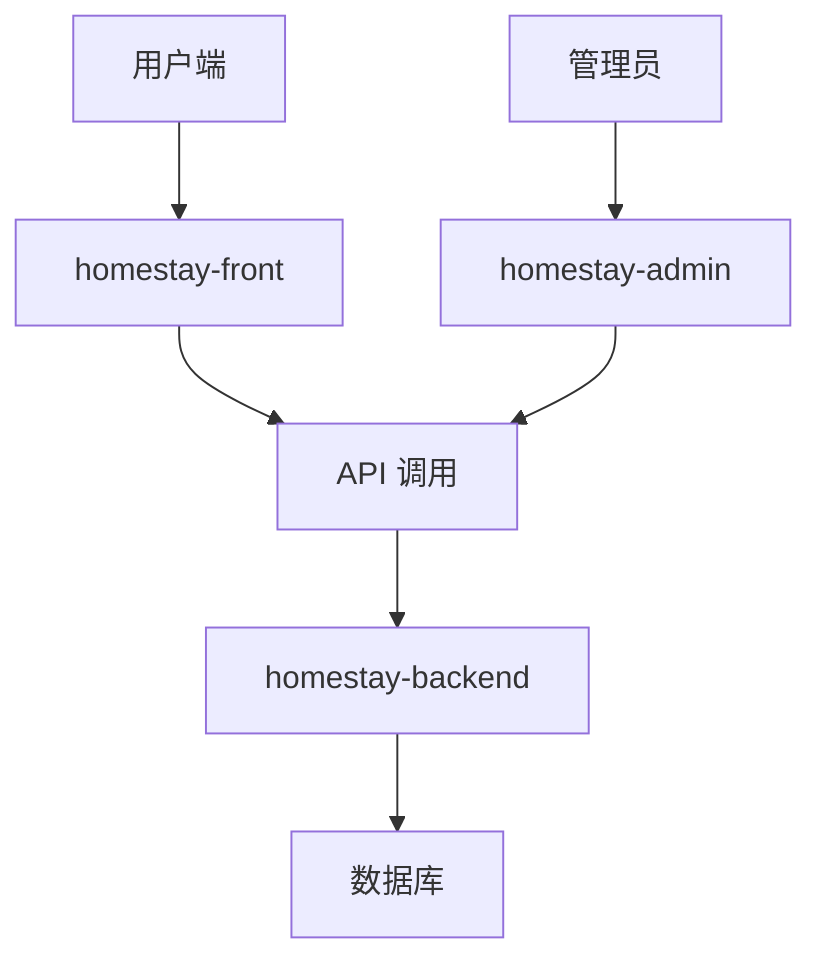

# Homestay 项目结构总览

> [!info] 项目概览
> 这是一个包含管理系统、后端服务和前端应用的完整民宿项目

## 项目根目录结构

```
homestay3/
├── homestay-admin/     # 管理后台系统
├── homestay-backend/   # 后端服务
├── homestay-front/     # 前端用户应用
├── tools/              # 工具脚本
├── .claude/           # Claude 配置
├── .cursor/           # Cursor 编辑器配置
├── .vscode/           # VSCode 配置
├── .gitignore         # Git 忽略配置
└── README.md          # 项目说明文档
```

## 核心模块说明

### 🏢 homestay-admin - 管理后台
- **技术栈**: Vue 3 + TypeScript + Vite
- **功能**: 民宿管理后台系统
- **特性**: 
  - 自动导入组件 (auto-imports.d.ts)
  - 组件类型声明 (components.d.ts)
  - TypeScript 完整支持

### 🔧 homestay-backend - 后端服务
- **功能**: 提供 API 服务和业务逻辑处理

### 📱 homestay-front - 前端应用
- **功能**: 面向用户的民宿预订前端

### 🛠️ tools - 工具脚本
- **功能**: 项目相关的工具和脚本

## 技术架构



## 快速导航

- [[homestay-admin 详细结构]]
- [[项目技术栈说明]]
- [[开发环境配置指南]]