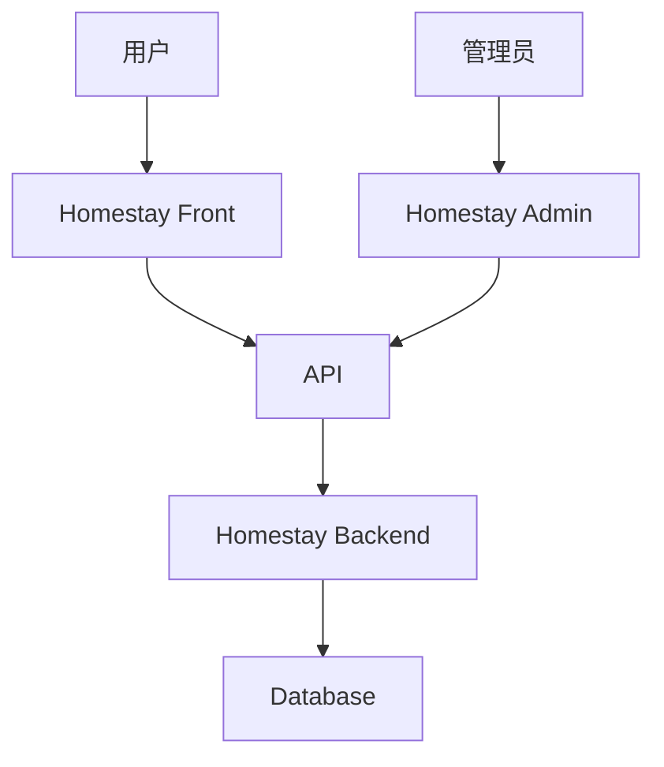

# Homestay 项目结构总览

> [!info] 项目架构
> 完整的民宿管理系统项目结构

## 目录结构

```
homestay3/
├── homestay-admin/         # 管理后台系统
│   ├── src/
│   │   ├── api/           # API 接口
│   │   ├── components/    # 组件
│   │   ├── views/         # 页面
│   │   ├── stores/        # 状态管理
│   │   └── router/        # 路由
│   └── package.json
├── homestay-backend/       # 后端服务
├── homestay-front/         # 前端用户应用
├── tools/                  # 工具脚本
└── obsidian-vault/         # 项目文档 (本目录)
```

## 模块关系



## 详细文档

- [[Homestay Admin 管理后台]] - 管理后台详细结构
- [[Homestay Backend 后端服务]] - 后端服务说明
- [[Homestay Front 前端应用]] - 前端应用说明
- [[项目技术栈]] - 技术栈详情
- [[开发环境配置]] - 环境搭建指南

## 索引

返回: [[Homestay 项目索引]]
