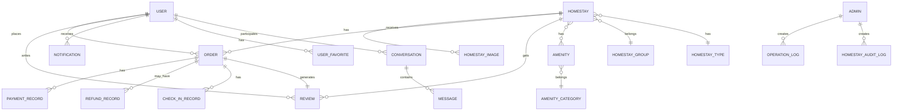

# 后端实体关系图

> [!info] 数据模型
> 后端 JPA 实体类关系说明

## 实体清单

### 核心业务实体

| 实体 | 表名 | 说明 |
|------|------|------|
| `Homestay` | homestays | 民宿房源 |
| `HomestayImage` | homestay_images | 房源图片 |
| `HomestayGroup` | homestay_groups | 房源分组 |
| `HomestayType` | homestay_types | 房源类型 |
| `HomestayAvailability` | homestay_availability | 房源可用性 |
| `HomestayAuditLog` | homestay_audit_logs | 房源审核日志 |

### 用户相关实体

| 实体 | 表名 | 说明 |
|------|------|------|
| `User` | users | 用户信息 |
| `Admin` | admins | 管理员信息 |
| `LoginLog` | login_logs | 登录日志 |

### 订单相关实体

| 实体 | 表名 | 说明 |
|------|------|------|
| `Order` | orders | 订单信息 |
| `PaymentRecord` | payment_records | 支付记录 |
| `RefundRecord` | refund_records | 退款记录 |
| `CheckInRecord` | check_in_records | 入住记录 |
| `CheckOutRecord` | check_out_records | 退房记录 |

### 评价相关实体

| 实体 | 表名 | 说明 |
|------|------|------|
| `Review` | reviews | 评价内容 |
| `ReviewImage` | review_images | 评价图片 |

### 设施相关实体

| 实体 | 表名 | 说明 |
|------|------|------|
| `Amenity` | amenities | 设施项目 |
| `AmenityCategory` | amenity_categories | 设施分类 |

### 系统管理实体

| 实体 | 表名 | 说明 |
|------|------|------|
| `Announcement` | announcements | 系统公告 |
| `Notification` | notifications | 通知消息 |
| `OperationLog` | operation_logs | 操作日志 |
| `SystemConfig` | system_configs | 系统配置 |
| `DisputeRecord` | dispute_records | 争议记录 |
| `ViolationReport` | violation_reports | 违规举报 |
| `ViolationAction` | violation_actions | 违规处理 |
| `Conversation` | conversations | 聊天会话 |
| `Message` | messages | 聊天消息 |
| `UserFavorite` | user_favorites | 用户收藏 |
| `Earning` | earnings | 收益记录 |

## 实体关系



## 核心实体字段

### Homestay (房源)

```java
id: Long
title: String              // 标题
type: String               // 类型
price: BigDecimal          // 价格
status: HomestayStatus     // 状态 (DRAFT/ACTIVE/INACTIVE)
maxGuests: Integer        // 最大入住人数
minNights: Integer        // 最少预订晚数
maxNights: Integer        // 最多预订晚数
description: String       // 描述
address: String           // 地址
groupId: Long             // 分组ID
```

### User (用户)

```java
id: Long
username: String
email: String
phone: String
password: String
role: UserRole            // 角色 (USER/HOST/ADMIN)
verified: Boolean         // 是否已认证
status: UserStatus        // 状态
```

### Order (订单)

```java
id: Long
orderNo: String           // 订单号
userId: Long              // 用户ID
homestayId: Long          // 房源ID
checkInDate: LocalDate    // 入住日期
checkOutDate: LocalDate   // 退房日期
totalAmount: BigDecimal   // 总金额
status: OrderStatus       // 订单状态
paymentStatus: PaymentStatus // 支付状态
```

## 枚举类型

| 枚举 | 说明 | 值 |
|------|------|-----|
| `HomestayStatus` | 房源状态 | DRAFT, ACTIVE, INACTIVE, DELETED |
| `OrderStatus` | 订单状态 | PENDING, PAID, CONFIRMED, CHECKED_IN, COMPLETED, CANCELLED |
| `PaymentStatus` | 支付状态 | PENDING, SUCCESS, FAILED, REFUNDED |
| `RefundStatus` | 退款状态 | PENDING, PROCESSING, SUCCESS, FAILED |
| `UserRole` | 用户角色 | USER, HOST, ADMIN |
| `VerificationStatus` | 认证状态 | PENDING, APPROVED, REJECTED |

## 相关笔记

- [[后端-架构总览]]
- [[后端-Controller 接口清单]]
- [[功能模块-房源管理]]
